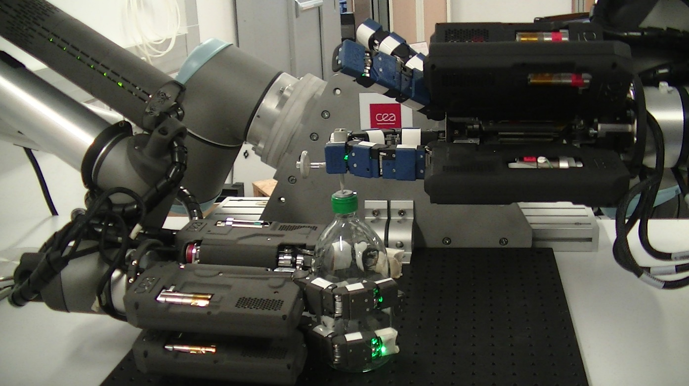

# Learning-based slip detection for adaptive grasp control in robotic manipulation

**PhD Thesis Project — Théo Ayral**  
CEA (Leti & List) · Université Paris-Saclay

  <a href="#publications">Publications</a> ·
  <a href="#code--resources">Code & Resources</a> ·
  <a href="#setup--benches">Setup</a> ·
  <a href="#method">Method</a> ·
  <a href="#results">Results</a> ·
  <a href="#latency">Latency</a>

---

  

  

  <strong>
    → Learn more about the TraceBot project and experimental platform on my PhD project page
  </strong> 
  <a href="https://thayral.github.io/PhD-manipulation/">
    https://thayral.github.io/PhD-manipulation/
  </a>

## Code & Resources

- **Demo (minimal runnable example):** https://github.com/thayral/<demo-repo>
- **Training / research code (implementation details):** https://github.com/thayral/<training-repo>
- **Slides (full, for deep dive):** https://thayral.github.io/phd-defense-slides/
- **Thesis manuscript (PDF):** https://github.com/thayral/<thesis-repo-or-pdf-link>

## Contact

- Email: 
- Scholar / website: 
- GitHub: https://github.com/thayral
