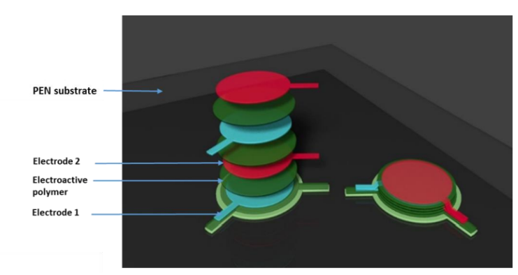
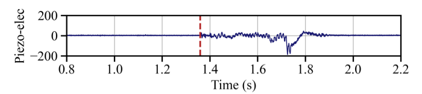
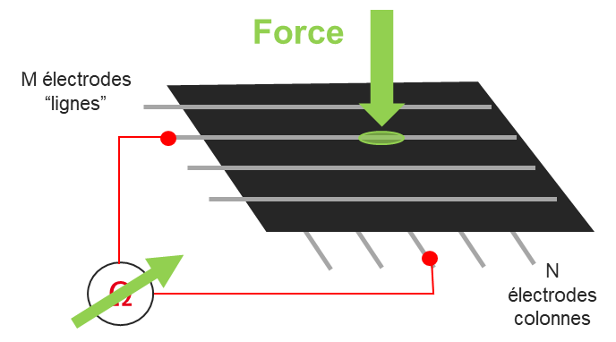
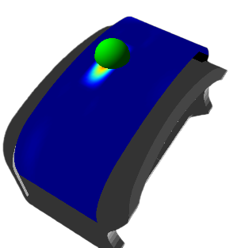

# Learning-based slip detection for adaptive grasp control in robotic manipulation

**PhD Thesis Project — Théo Ayral**  
CEA (Leti & List) · Université Paris-Saclay

---

## CONTEXT: TraceBot Project

Robotic manipulation in critical environements.

TraceBot is an EU project developing robotic systems that can **verify and trace manipulation actions** (“audit trail”) for regulated environments, with a focus on handling sterile medical products. 

  

    <video autoplay loop muted playsinline style="width:100%; height:auto; display:block;">
      <source src="media/tracebot-process.mp4" type="video/mp4">
    </video>

    

    
  

  <!-- Bottom-right logo -->
  

    

      
    

  

## TraceBot / manipulation platform

  <table style="width:80%; border-collapse:collapse;">
    <tr>
      <td width="40%" valign="middle" align="center" style="padding:6px;">
        <video autoplay loop muted playsinline style="width:100%; height:auto; display:block;">
          <source src="media/gripper_demo_2_640.mp4" type="video/mp4">
        </video>
      </td>
      <td width="40%" valign="middle" align="center" style="padding:6px;">
        <video autoplay loop muted playsinline style="width:100%; height:auto; display:block;">
          <source src="media/gripper_demo_3_640.mp4" type="video/mp4">
        </video>
      </td>
    </tr>
    <tr>
      <td width="40%" valign="middle" align="center" style="padding:6px;">
        <video autoplay loop muted playsinline style="width:100%; height:auto; display:block;">
          <source src="media/gripper_demo_6_640.mp4" type="video/mp4">
        </video>
      </td>
      <td width="40%" valign="middle" align="center" style="padding:6px;">
        <video autoplay loop muted playsinline style="width:100%; height:auto; display:block;">
          <source src="media/gripper_demo_10_640.mp4" type="video/mp4">
        </video>
      </td>
    </tr>
  </table>

## Hardware

  
<strong>Multifingered gripper & actuation</strong>

  

  

  

    <ul>
      <li><strong>Four-fingered, 14-DoF gripper</strong></li>
      <li><strong>Backdrivable tendon actuation</strong> enabling haptic interaction</li>
      <li>Designed for multi-contact grasping and internal force control</li>
    </ul>
  

  

    <iframe
      src="https://player.vimeo.com/video/1056472782?h=0&title=0&byline=0&portrait=0"
      style="position:absolute; top:0; left:0; width:100%; height:100%;"
      frameborder="0"
      allow="autoplay; fullscreen; picture-in-picture"
      allowfullscreen>
    </iframe>
  

  
<strong>Piezoelectric tactile sensing (PzE) — slip detection</strong>

<table style="width:70%; margin:16px auto; border-collapse:collapse;">
  <tr>
    <td width="50%" align="center" valign="middle" style="padding:6px;">
      
    </td>
    <td width="50%" align="center" valign="middle" style="padding:6px;">
      
    </td>
  </tr>
</table>

  

    

      Piezoelectric sensors capture high-frequency dynamics,
      enabling detection of dynamic tactile events and incipient slip.
    

  <ul>
    <li><strong>Piezoelectric PVDF–TrFE</strong> tactile transducers</li>
    <li><strong>High-bandwidth sensing</strong>: 10 kHz sampling (30 Hz – 2.5 kHz effective)</li>
    <li>Captures <strong>friction-induced vibrations</strong> and dynamic slip events</li>
  </ul>
  

    → <a href="https://github.com/thayral/tactile-slip-detection-pze">
      Slip detection using spectro-temporal learning
    </a>
  

  

  
<strong>Piezoresistive tactile arrays (PzR) — contact estimation</strong>

<table style="width:70%; margin:16px auto; border-collapse:collapse;">
  <tr>
    <td width="50%" align="center" valign="middle" style="padding:6px;">
      
    </td>
    <td width="50%" align="center" valign="middle" style="padding:6px;">
      
    </td>
  </tr>
</table>

  

    

      Piezoresistive arrays provide pressure distribution and contact localization,
      supporting grasp modeling and internal force coordination.
    

  <ul>
    <li><strong>Piezoresistive polymer (Velostat™)</strong> tactile arrays</li>
    <li><strong>8×8 taxel matrix</strong> from orthogonal electrode sheets</li>
    <li>Provides <strong>pressure distribution</strong>, contact area, and CoP estimation</li>
  </ul>
  

    → <a href="https://github.com/thayral/reactive-slip-control">
      Use in contact estimation for internal-force control
    </a>
  

  

## Contributions

The contributions build on each other, following the narrative flow of the thesis:

  

    
  

### C1 — Early slip detection from tactile vibrations
Detect **incipient slip** from high-bandwidth tactile vibrations using learning-based spectro-temporal analysis, operating in **real time (100 Hz)**.

**Related publications**
- **AIM 2023 (published)**  
  *Spectro-Temporal Recurrent Neural Network for Robotic Slip Detection with Piezoelectric Tactile Sensor*  
  Théo Ayral, Saifeddine Aloui, Mathieu Grossard

**Project page**
- → GitHub demo:  
  [https://github.com/thayral/tactile-slip-demo](https://github.com/thayral/tactile-slip-demo)

---

### C2 — Data-driven robustness to manipulation perturbations
Improve robustness to transient events and actuation noise through **perturbation-aware training** and haptic data fusion, reducing false alarms while preserving low detection latency.

- Robustness: **38.77 % → 90.43 %**
- Average detection delay: **24.1 ms**
- Perfect recall on slip events

**Related publications**
- *(in preparation)*  
  *Robust Tactile Slip Detection under Manipulation Perturbations*
  Théo Ayral, Saifeddine Aloui, Mathieu Grossard
  
---

### C3 — Closed-loop adaptation of grasp forces
Stabilize **multi-fingered grasps** by injecting **internal forces** based on tactile feedback, without relying on explicit friction models.

**Related publications**
- **ICRA 2026 (accepted)**  
  *Reactive Slip Control in Multifingered Grasping: Hybrid Tactile Sensing and Internal-Force Optimization*  
  Théo Ayral, Saifeddine Aloui, Mathieu Grossard

- **Patent application (2025)**  
  *Robotic gripper and control method*  
  M. Grossard, S. Aloui, T. Ayral — US Patent Application 19/011,931

**Project page**
- → Reactive slip control:  
  [https://github.com/thayral/reactive-slip-control](https://thayral.github.io/reactive-slip-control/)

---

## Code & Resources

- **Demo (minimal runnable example):** [https://github.com/thayral/tactile-slip-demo](https://github.com/thayral/tactile-slip-demo)
- **Training / research code (implementation details):** soon
- **Slides (full, for deep dive):** [https://thayral.github.io/phd-defense-slides/](https://thayral.github.io/phd-defense-slides/)
- **Thesis manuscript (PDF):** [https://theses.hal.science/tel-05468226](https://theses.hal.science/tel-05468226)

<table>
  <tr>
    <td>
      
    </td>
  </tr>
</table>

## Contact
Théo AYRAL

➡️ This work is part of the PhD thesis  
**Learning-based slip detection for adaptive grasp control**  
CEA (Leti & List) · Université Paris-Saclay
[https://github.com/thayral/PhD-manipulation](https://github.com/thayral/PhD-manipulation)
