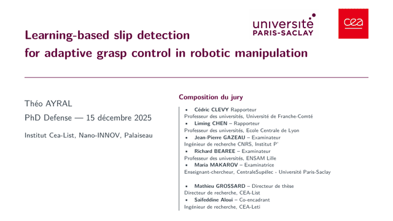

# Learning-based slip detection for adaptive grasp control in robotic manipulation

**PhD Thesis Project — Théo Ayral**  
CEA (Leti & List) · Université Paris-Saclay

  <a href="#publications">Publications</a> ·
  <a href="#code--resources">Code & Resources</a> ·
  <a href="#setup--benches">Setup</a> ·
  <a href="#method">Method</a> ·
  <a href="#results">Results</a> ·
  <a href="#latency">Latency</a>

---

## Contributions and related work

### C1 — Early slip detection from tactile vibrations
Detect **incipient slip** from high-bandwidth tactile vibrations using learning-based spectro-temporal analysis, operating in **real time (100 Hz)**.

**Related publications**
- **AIM 2023 (published)**  
  *Spectro-Temporal Recurrent Neural Network for Robotic Slip Detection with Piezoelectric Tactile Sensor*  
  Théo Ayral, Saifeddine Aloui, Mathieu Grossard

- *(in preparation)*  
  *Robust Tactile Slip Detection under Manipulation Perturbations*  
  Théo Ayral, Saifeddine Aloui, Mathieu Grossard

**Project page**
- → Tactile slip detection:  
  https://github.com/thayral/tactile-slip-detection-pze

---

### C2 — Data-driven robustness to manipulation perturbations
Improve robustness to transient events and actuation noise through **perturbation-aware training** and haptic data fusion, reducing false alarms while preserving low detection latency.

- Robustness: **38.77 % → 90.43 %**
- Average detection delay: **24.1 ms**
- Perfect recall on slip events

**Related publications**
- *(in preparation)*  
  *Robust Tactile Slip Detection under Manipulation Perturbations*

**Project pages**
- → Tactile slip detection (training & data):  
  https://github.com/thayral/tactile-slip-detection-pze
- → Reactive slip control (use in closed loop):  
  https://github.com/thayral/reactive-slip-control

---

### C3 — Closed-loop adaptation of grasp forces
Stabilize **multi-fingered grasps** by injecting **internal forces** based on tactile feedback, without relying on explicit friction models.

**Related publications**
- **ICRA 2026 (accepted)**  
  *Reactive Slip Control in Multifingered Grasping: Hybrid Tactile Sensing and Internal-Force Optimization*  
  Théo Ayral, Saifeddine Aloui, Mathieu Grossard

- **Patent application (2025)**  
  *Robotic gripper and control method*  
  M. Grossard, S. Aloui, T. Ayral — US Patent Application 19/011,931

**Project page**
- → Reactive slip control:  
  https://github.com/thayral/reactive-slip-control

---

## Publications

- **AIM 2023 (published)**  
  *Spectro-Temporal Recurrent Neural Network for Robotic Slip Detection with Piezoelectric Tactile Sensor*  
  Théo Ayral, Saifeddine Aloui, Mathieu Grossard

- **(in preparation)**  
  *Robust Tactile Slip Detection under Manipulation Perturbations*  
  Théo Ayral, Saifeddine Aloui, Mathieu Grossard

- **ICRA 2026 (accepted)**  
  *Reactive Slip Control in Multifingered Grasping: Hybrid Tactile Sensing and Internal-Force Optimization*  
  Théo Ayral, Saifeddine Aloui, Mathieu Grossard

- **Patent application (2025)**  
  *Robotic gripper and control method*  
  M. Grossard, S. Aloui, T. Ayral — US Patent Application 19/011,931

---

## CONTEXT 
Critical environments GIF + robotisation

### TraceBot / manipulation platform
- Multi-finger gripper with **hybrid tactile sensing**
- PzE: high-bandwidth friction-vibration sensing (slip cues)
- PzR: spatial pressure/contact localization (contact geometry update)

## Gripper demos (TraceBot context) {#gripper-demos}

  <table style="width:100%; border-collapse:collapse;">
    <tr>
      <td width="50%" valign="middle" align="center" style="padding:6px;">
        <video autoplay loop muted playsinline style="width:100%; height:auto; display:block;">
          <source src="media/gripper_demo_2_640.mp4" type="video/mp4">
        </video>
      </td>
      <td width="50%" valign="middle" align="center" style="padding:6px;">
        <video autoplay loop muted playsinline style="width:100%; height:auto; display:block;">
          <source src="media/gripper_demo_3_640.mp4" type="video/mp4">
        </video>
      </td>
    </tr>
    <tr>
      <td width="50%" valign="middle" align="center" style="padding:6px;">
        <video autoplay loop muted playsinline style="width:100%; height:auto; display:block;">
          <source src="media/gripper_demo_6_640.mp4" type="video/mp4">
        </video>
      </td>
      <td width="50%" valign="middle" align="center" style="padding:6px;">
        <video autoplay loop muted playsinline style="width:100%; height:auto; display:block;">
          <source src="media/gripper_demo_10_640.mp4" type="video/mp4">
        </video>
      </td>
    </tr>
  </table>

## GRIPPER

<!-- Vimeo embed (works on GitHub Pages) -->

  

    <iframe
      src="https://player.vimeo.com/video/1056472782?h=0&title=0&byline=0&portrait=0"
      style="position:absolute; top:0; left:0; width:60%; height:60%;"
      frameborder="0"
      allow="autoplay; fullscreen; picture-in-picture"
      allowfullscreen>
    </iframe>
  

## FINGER SENSOR
## maybe sensors signals (after problem)

<table>
  <tr>
    <td>
      
    </td>
  </tr>
</table>

## Code & Resources

- **Demo (minimal runnable example):** https://github.com/thayral/<demo-repo>
- **Training / research code (implementation details):** https://github.com/thayral/<training-repo>
- **Slides (full, for deep dive):** https://thayral.github.io/phd-defense-slides/
- **Thesis manuscript (PDF):** https://github.com/thayral/<thesis-repo-or-pdf-link>

## Contact

- Email: 
- Scholar / website: 
- GitHub: https://github.com/thayral
